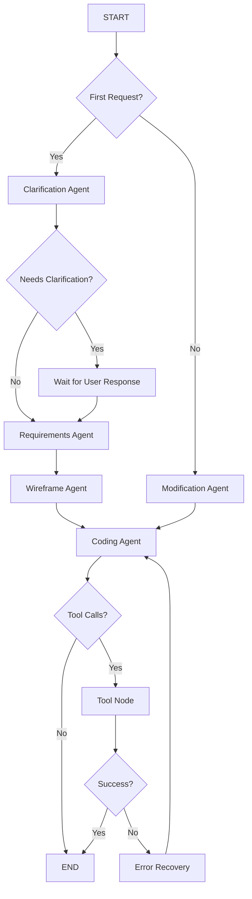

# LangGraph Migration Plan

## Table of Contents

1. [Executive Summary](#executive-summary)
2. [Current Architecture Analysis](#current-architecture-analysis)
3. [Target LangGraph Architecture](#target-langgraph-architecture)
4. [Detailed Technical Design](#detailed-technical-design)
5. [Migration Phases](#migration-phases)
6. [Risk Assessment](#risk-assessment)
7. [Testing Strategy](#testing-strategy)
8. [Timeline and Dependencies](#timeline-and-dependencies)
9. [Implementation Examples](#implementation-examples)

---

## 1. Executive Summary

### Migration Goals

This document outlines the migration from the current custom pipeline orchestration system to **LangGraph** for multi-agent collaboration and workflow orchestration. The migration will transform our simple sequential agent execution into a sophisticated graph-based system with proper LLM integration, conditional flows, and advanced tool calling capabilities.

### Key Benefits

**🚀 Enhanced Capabilities:**
- Real LLM integration (replacing mock responses)
- Sophisticated conditional agent routing
- Advanced tool calling with LangGraph's ToolNode
- Streaming execution with real-time progress updates
- Better error handling and retry mechanisms

**🏗️ Improved Architecture:**
- Graph-based agent orchestration
- Declarative agent flow definitions
- Centralized state management
- Built-in debugging and observability
- Easier testing and maintenance

**🔄 Maintained Compatibility:**
- Full AG-UI protocol compatibility
- Existing Docker container integration
- Current WebSocket communication
- All existing tools and features

### Migration Approach

The migration follows a **6-phase incremental approach** that maintains system stability while adding LangGraph capabilities. Each phase is independently testable and can be rolled back if needed.

**Model Configuration:** The system will use **GPT-4.1** as the primary LLM, configured through your existing Azure OpenAI deployment. GPT-4.1 provides enhanced reasoning capabilities and better code generation compared to earlier models, making it ideal for the complex multi-agent workflows in this application.

---

## 2. Current Architecture Analysis

### Current System Overview

```
┌─────────────────┐    ┌─────────────────┐    ┌─────────────────┐
│   WebSocket     │───▶│   Pipeline      │───▶│     Agents      │
│   Handler       │    │   Selector      │    │   (Sequential)  │
└─────────────────┘    └─────────────────┘    └─────────────────┘
                                │                        │
                                ▼                        ▼
                       ┌─────────────────┐    ┌─────────────────┐
                       │  Context State  │    │  Mock LLM       │
                       │   Management    │    │  Responses      │
                       └─────────────────┘    └─────────────────┘
```

### Identified Pain Points

**1. No Real LLM Integration**
- All agent responses are hardcoded mock responses
- No actual AI reasoning or dynamic response generation
- Limited to predefined scenarios and templates

**2. Simple Sequential Execution**
- Agents execute in rigid for-loop sequence
- No conditional routing or dynamic flow control
- Difficult to add complex agent interaction patterns

**3. Manual Tool Integration**
- Tools are called imperatively within agent code
- No standardized tool calling interface
- Limited tool composition and chaining

**4. Limited State Management**
- Simple context passing between agents
- No sophisticated state tracking or rollback
- Difficult to implement complex conversation flows

**5. Deprecated Dependencies**
- Uses `@azure/openai` which is deprecated
- Missing modern LangChain ecosystem benefits
- Limited observability and debugging capabilities

**6. Scaling Limitations**
- Hard to add new agent types or modify flows
- Limited error recovery and retry mechanisms
- No built-in streaming or progress tracking

---

## 3. Target LangGraph Architecture

### High-Level Architecture

```
┌─────────────────┐    ┌─────────────────┐    ┌─────────────────┐
│   WebSocket     │───▶│   LangGraph     │───▶│  Agent Nodes    │
│   Handler       │    │   Orchestrator  │    │   (Parallel)    │
└─────────────────┘    └─────────────────┘    └─────────────────┘
                                │                        │
                                ▼                        ▼
                       ┌─────────────────┐    ┌─────────────────┐
                       │  Graph State    │    │  Real LLM       │
                       │   Management    │    │  Integration    │
                       └─────────────────┘    └─────────────────┘
                                                        │
                                                        ▼
                                               ┌─────────────────┐
                                               │   Tool Nodes   │
                                               │  (Declarative)  │
                                               └─────────────────┘
```

### Core Components

**1. StateGraph Definition**
- Central state object flowing between all nodes
- Automatic state updates and persistence
- Built-in checkpoint and rollback capabilities

**2. Agent Nodes**
- Specialized functions for each agent type
- Real LLM integration with proper prompting
- Conditional execution based on state

**3. Tool Nodes**
- Centralized tool execution with ToolNode
- Declarative tool calling from LLM responses
- Automatic tool result integration

**4. Conditional Edges**
- Dynamic routing between agents
- Context-aware decision making
- Complex flow control patterns

**5. Streaming Execution**
- Real-time progress updates
- AG-UI event emission during execution
- Responsive user experience

### Graph Structure



---

## 4. Detailed Technical Design

### State Schema

```typescript
import { BaseMessage } from "@langchain/core/messages";
import { Annotation } from "@langchain/langgraph";

// LangGraph State Definition
export const AppBuilderState = Annotation.Root({
  // Core conversation data
  messages: Annotation<BaseMessage[]>({
    reducer: (current, update) => current.concat(update),
    default: () => []
  }),
  
  // Conversation metadata
  conversationId: Annotation<string>(),
  isFirstRequest: Annotation<boolean>({
    default: () => true
  }),
  
  // Agent workflow state
  currentAgent: Annotation<string>({
    reducer: (current, update) => update ?? current,
    default: () => "start"
  }),
  
  // Application generation state
  requirements: Annotation<string | null>({
    reducer: (current, update) => update ?? current,
    default: () => null
  }),
  
  wireframe: Annotation<string | null>({
    reducer: (current, update) => update ?? current,
    default: () => null
  }),
  
  generatedCode: Annotation<Record<string, string>>({
    reducer: (current, update) => ({ ...current, ...update }),
    default: () => ({})
  }),
  
  // Container and deployment info
  containerInfo: Annotation<{
    containerId?: string;
    port?: number;
    status?: string;
  }>({
    reducer: (current, update) => ({ ...current, ...update }),
    default: () => ({})
  }),
  
  // Error handling
  lastError: Annotation<{
    agent: string;
    error: string;
    timestamp: string;
  } | null>({
    reducer: (current, update) => update ?? current,
    default: () => null
  }),
  
  retryCount: Annotation<number>({
    reducer: (current, update) => update ?? current ?? 0,
    default: () => 0
  }),
  
  // Completion tracking
  lastToolExecution: Annotation<Array<{
    name: string;
    input: any;
    output: string;
    timestamp: string;
  }>>({
    reducer: (current, update) => update ?? current,
    default: () => []
  }),
  
  completionState: Annotation<{
    explorationComplete: boolean;
    buildSuccessful: boolean;
    devServerStarted: boolean;
    requirementsMet: boolean;
    isComplete: boolean;
  }>({
    reducer: (current, update) => ({ ...current, ...update }),
    default: () => ({
      explorationComplete: false,
      buildSuccessful: false,
      devServerStarted: false,
      requirementsMet: false,
      isComplete: false
    })
  }),
  
  // AG-UI compatibility
  aguiEvents: Annotation<any[]>({
    reducer: (current, update) => current.concat(update),
    default: () => []
  })
});

export type AppBuilderStateType = typeof AppBuilderState.State;
```

### Agent Node Implementation

```typescript
import { ChatOpenAI } from "@langchain/openai";
import { ChatPromptTemplate } from "@langchain/core/prompts";
import { HumanMessage, AIMessage } from "@langchain/core/messages";

// Clarification Agent Node
export async function clarificationAgent(
  state: AppBuilderStateType
): Promise<Partial<AppBuilderStateType>> {
  console.log("🤖 Executing Clarification Agent");
  
  // Import existing agent configuration for validation logic
  const { clarificationAgentConfig } = await import('../agents/clarificationAgent.js');
  
  // Apply skipOn logic from existing configuration
  const shouldSkip = clarificationAgentConfig.skipOn?.({
    state: state,
    isFirstRequest: state.isFirstRequest,
    messages: state.messages,
    conversationId: state.conversationId,
    events: null as any, // Events handled differently in LangGraph
    userInput: state.messages[state.messages.length - 1]?.content || ''
  });
  
  if (shouldSkip) {
    console.log("⏭️ Skipping clarification based on existing logic");
    return {
      messages: [],
      currentAgent: "clarification"
    };
  }
  
  // Get the latest user message
  const lastMessage = state.messages[state.messages.length - 1];
  const userInput = lastMessage.content;
  
  // Create LLM with proper configuration
  const llm = new ChatOpenAI({
    model: "gpt-4.1",
    temperature: 0.3,
    azureOpenAIApiKey: process.env.AOAI_4_1_API_KEY,
    azureOpenAIApiInstanceName: process.env.AOAI_4_1_INSTANCE_NAME,
    azureOpenAIApiDeploymentName: process.env.AOAI_4_1_DEPLOYMENT_NAME,
    azureOpenAIApiVersion: process.env.AOAI_4_1_VERSION,
  });
  
  // Create clarification prompt using existing system prompt
  const prompt = ChatPromptTemplate.fromMessages([
    ["system", `You are a helpful assistant that asks clarifying questions about web application requirements.

Your role is to understand what the user wants to build by asking specific, targeted questions.

Guidelines:
- Ask max 5 specific questions
- Focus on understanding the user request and what they try to build.
- Be concise and professional
- Don't assume user has any technical knowledge. 
- The questions should be to clarify user request and what they want to build.
- Avoid generic questions like "What do you want to build?" - be specific.
- Don't ask about technical details like frameworks, languages, or libraries.
- Help the user think through their requirements.
- You can skip asking questions if the user request is already clear. In that case you can thanks the user for their request and say please click continue to proceed.

Question areas to explore:
1. Application type (form, dashboard, game, e-commerce, etc.)
2. Specific features or constraints.
3. Any ambiguities in the request.

Format your response as a friendly conversation, not a formal questionnaire.

IMPORTANT: Always end your response with this exact text:
"You can respond to one or more of these questions or simply click continue"

User Request: {input}`],
    ["user", "{input}"]
  ]);
  
  // Execute LLM call
  const chain = prompt.pipe(llm);
  const response = await chain.invoke({ input: userInput });
  
  // Apply validation logic from existing configuration
  const mockContext = {
    state: { clarification_result: { response: response.content } },
    // ... other context properties
  };
  
  const isValid = clarificationAgentConfig.validateOutput?.(mockContext as any);
  if (!isValid) {
    console.warn("⚠️ Clarification response validation failed, retrying...");
    // Could implement retry logic here
  }
  
  // Emit AG-UI events for real-time streaming
  const events = [
    {
      type: "TEXT_MESSAGE_START",
      conversationId: state.conversationId,
      messageId: generateId(),
      role: "assistant",
      timestamp: Date.now()
    },
    {
      type: "TEXT_MESSAGE_CONTENT",
      conversationId: state.conversationId,
      messageId: generateId(),
      delta: response.content,
      timestamp: Date.now()
    },
    {
      type: "TEXT_MESSAGE_END",
      conversationId: state.conversationId,
      messageId: generateId(),
      timestamp: Date.now()
    }
  ];
  
  return {
    messages: [new AIMessage(response.content)],
    currentAgent: "clarification",
    aguiEvents: events
  };
}
```

### Tool Integration

```typescript
import { tool } from "@langchain/core/tools";
import { z } from "zod";
import { ToolNode } from "@langchain/langgraph/prebuilt";

// Convert existing AppContainer to LangGraph tool
export const appContainerTool = tool(
  async ({ command }: { command: string }) => {
    const appContainer = new AppContainer();
    await appContainer.initialize();
    
    try {
      const result = await appContainer.executeCommand(command);
      return JSON.stringify({
        success: true,
        output: result.output,
        exitCode: result.exitCode
      });
    } catch (error) {
      return JSON.stringify({
        success: false,
        error: error.message
      });
    }
  },
  {
    name: "app_container",
    description: "Execute commands in the Docker container environment for app generation",
    schema: z.object({
      command: z.string().describe("The bash command to execute in the container")
    })
  }
);

// Convert browser automation to LangGraph tool
export const browserTool = tool(
  async ({ action, url, options }: { 
    action: string; 
    url?: string; 
    options?: any 
  }) => {
    const browser = new BrowserAutomation();
    
    try {
      let result;
      switch (action) {
        case "screenshot":
          result = await browser.takeScreenshot(url, options);
          break;
        case "test":
          result = await browser.testApplication(url, options);
          break;
        default:
          throw new Error(`Unknown browser action: ${action}`);
      }
      
      return JSON.stringify({
        success: true,
        result
      });
    } catch (error) {
      return JSON.stringify({
        success: false,
        error: error.message
      });
    }
  },
  {
    name: "browser_automation",
    description: "Perform browser automation tasks like screenshots and testing",
    schema: z.object({
      action: z.enum(["screenshot", "test"]).describe("The browser action to perform"),
      url: z.string().optional().describe("The URL to perform the action on"),
      options: z.any().optional().describe("Additional options for the action")
    })
  }
);

// Application completion tool - explicit completion signal
export const appCompletedTool = tool(
  async ({ 
    buildSuccessful, 
    devServerRunning, 
    requirementsMet, 
    summary 
  }: { 
    buildSuccessful: boolean;
    devServerRunning: boolean;
    requirementsMet: boolean;
    summary: string;
  }) => {
    // Validate completion criteria
    const isValid = buildSuccessful && devServerRunning && requirementsMet;
    
    if (!isValid) {
      return JSON.stringify({
        success: false,
        message: "Completion criteria not met. Please ensure build succeeds, dev server runs, and all requirements are implemented.",
        criteria: {
          buildSuccessful,
          devServerRunning,
          requirementsMet
        }
      });
    }
    
    return JSON.stringify({
      success: true,
      message: "Application development completed successfully!",
      summary,
      timestamp: new Date().toISOString()
    });
  },
  {
    name: "app_completed",
    description: "Signal that application development is complete. Use this tool ONLY when all criteria are met: build succeeds, dev server runs, and all requirements implemented.",
    schema: z.object({
      buildSuccessful: z.boolean().describe("True if 'npm run build' completed successfully"),
      devServerRunning: z.boolean().describe("True if 'npm run dev' started successfully"),
      requirementsMet: z.boolean().describe("True if all user requirements are implemented"),
      summary: z.string().describe("Brief summary of what was built and key features implemented")
    })
  }
);

// Create tool node for centralized tool execution
export const toolNode = new ToolNode([appContainerTool, browserTool, appCompletedTool]);
```

### Completion Detection and Routing

**The Challenge:** How does the coding agent signal completion vs needing more work?

**The Solution:** Tool-based completion detection system with explicit validation:

**1. Dedicated Completion Tool**
- Agent calls `app_completed` tool when finished
- Tool validates completion criteria automatically
- No reliance on string matching or response parsing
- Clear, unambiguous completion signal

**2. Validation-Based Routing**
```typescript
function routeAfterTools(state: AppBuilderStateType): string {
  const completionTool = state.lastToolExecution?.find(tool => 
    tool.name === 'app_completed'
  );
  
  if (completionTool) {
    const result = JSON.parse(completionTool.output);
    return result.success ? END : "coding"; // Route back if validation fails
  }
  
  return state.currentAgent || "coding";
}
```

**3. Automatic Criteria Validation**
- Tool checks: build success, dev server running, requirements met
- Agent must provide boolean flags for each criterion
- Tool validates and provides success/failure response
- Failed validation automatically routes back to coding

**4. Structured Completion Data**
```typescript
{
  name: "app_completed",
  args: {
    buildSuccessful: true,
    devServerRunning: true,
    requirementsMet: true,
    summary: "Built todo app with all requested features"
  }
}
```

**5. Robust Error Recovery**
- Tool validation fails → Route back to coding agent
- Missing completion criteria → Tool returns error message
- Agent learns from validation failures in next iteration
- Prevents premature completion claims

**Benefits of Tool-Based Approach:**
- ✅ **Reliable**: No string parsing or pattern matching
- ✅ **Explicit**: Clear completion signal through tool call
- ✅ **Validated**: Automatic verification of completion criteria
- ✅ **Debuggable**: Tool calls are easily traceable
- ✅ **Extensible**: Easy to add new completion criteria
- ✅ **Type-Safe**: Zod schema ensures correct data format

This ensures reliable completion detection and prevents premature pipeline termination.

---

### Graph Construction

```typescript
import { StateGraph, START, END } from "@langchain/langgraph";

// Router function for conditional edges
function routeAfterClarification(state: AppBuilderStateType): string {
  const lastMessage = state.messages[state.messages.length - 1];
  
  // Check if the clarification response indicates the request is clear
  if (typeof lastMessage.content === "string" && 
      (lastMessage.content.includes("click continue to proceed") ||
       lastMessage.content.includes("please click continue"))) {
    return "requirements";
  }
  
  // If clarification questions were asked, wait for user response
  if (typeof lastMessage.content === "string" && 
      lastMessage.content.includes("You can respond to one or more")) {
    return "wait_for_user";
  }
  
  // Default to waiting for user response
  return "wait_for_user";
}

function routeAfterAgent(state: AppBuilderStateType): string {
  const lastMessage = state.messages[state.messages.length - 1];
  
  // Check if agent made tool calls
  if (lastMessage.tool_calls && lastMessage.tool_calls.length > 0) {
    // Check if any tool call is the completion signal
    const hasCompletionCall = lastMessage.tool_calls.some(call => 
      call.name === "app_completed"
    );
    
    if (hasCompletionCall) {
      // Agent signaled completion - validate after tool execution
      return "tools";
    }
    
    // Regular tool calls - continue to tool execution
    return "tools";
  }
  
  // Check if we need to continue to next agent in pipeline
  if (state.currentAgent === "requirements") {
    return "wireframe";
  } else if (state.currentAgent === "wireframe") {
    return "coding";
  } else if (state.currentAgent === "coding") {
    // If coding agent responded without tool calls, route back for more work
    return "coding";
  }
  
  return END;
}

// Enhanced completion validation using tool results
function validateCodingCompletion(state: AppBuilderStateType): boolean {
  const lastToolExecutions = state.lastToolExecution || [];
  
  // Check if app_completed tool was called successfully
  const completionCall = lastToolExecutions.find(tool => 
    tool.name === 'app_completed'
  );
  
  if (!completionCall) {
    return false;
  }
  
  // Parse completion tool result
  try {
    const result = JSON.parse(completionCall.output);
    return result.success === true;
  } catch (error) {
    console.error("Failed to parse completion tool result:", error);
    return false;
  }
}

// Enhanced routing after tool execution
function routeAfterTools(state: AppBuilderStateType): string {
  const lastToolExecutions = state.lastToolExecution || [];
  
  // Check if completion tool was executed successfully
  const completionTool = lastToolExecutions.find(tool => 
    tool.name === 'app_completed'
  );
  
  if (completionTool) {
    try {
      const result = JSON.parse(completionTool.output);
      if (result.success) {
        // Completion validated - end the pipeline
        return END;
      } else {
        // Completion failed validation - continue coding
        console.log("🔄 Completion validation failed, continuing development...");
        return "coding";
      }
    } catch (error) {
      console.error("Error parsing completion result:", error);
      return "coding";
    }
  }
  
  // Regular tool execution - route back to current agent
  return state.currentAgent || "coding";
}

// Build the initial pipeline graph
export function buildInitialPipelineGraph() {
  const graph = new StateGraph(AppBuilderState)
    .addNode("clarification", clarificationAgent)
    .addNode("requirements", requirementsAgent)
    .addNode("wireframe", wireframeAgent)
    .addNode("coding", codingAgent)
    .addNode("tools", toolNode)
    .addNode("wait_for_user", waitForUserNode);
  
  // Define the flow
  graph
    .addEdge(START, "clarification")
    .addConditionalEdges("clarification", routeAfterClarification, {
      requirements: "requirements",
      wait_for_user: "wait_for_user"
    })
    .addEdge("wait_for_user", "requirements")
    .addConditionalEdges("requirements", routeAfterAgent, {
      wireframe: "wireframe",
      tools: "tools",
      [END]: END
    })
    .addConditionalEdges("wireframe", routeAfterAgent, {
      coding: "coding",
      tools: "tools",
      [END]: END
    })
    .addConditionalEdges("coding", routeAfterAgent, {
      tools: "tools",
      coding: "coding",
      [END]: END
    })
    .addConditionalEdges("tools", routeAfterTools, {
      requirements: "requirements",
      wireframe: "wireframe", 
      coding: "coding",
      [END]: END
    });
  
  return graph.compile();
}

// Build the modification pipeline graph
export function buildModificationPipelineGraph() {
  const graph = new StateGraph(AppBuilderState)
    .addNode("modification", modificationAgent)
    .addNode("coding", codingAgent)
    .addNode("tools", toolNode);
  
  graph
    .addEdge(START, "modification")
    .addConditionalEdges("modification", routeAfterAgent, {
      coding: "coding",
      tools: "tools",
      [END]: END
    })
    .addConditionalEdges("coding", routeAfterAgent, {
      tools: "tools",
      coding: "coding",
      [END]: END
    })
    .addConditionalEdges("tools", routeAfterTools, {
      modification: "modification",
      coding: "coding",
      [END]: END
    });
  
  return graph.compile();
}
```

---

## 5. Migration Phases

### Phase 1: Dependencies and Infrastructure Setup

**Objectives:**
- Set up LangGraph development environment
- Install required dependencies
- Create basic state schema and interfaces

**Tasks:**

**1.1 Install LangGraph Dependencies**
```bash
npm install @langchain/langgraph @langchain/core @langchain/openai
npm install zod  # For tool schema definitions
npm uninstall @azure/openai  # Remove deprecated dependency
```

**1.2 Update Package.json**
```json
{
  "dependencies": {
    "@langchain/langgraph": "^0.2.0",
    "@langchain/core": "^0.3.0", 
    "@langchain/openai": "^0.3.0",
    "zod": "^3.22.0"
  }
}
```

**1.3 Create State Schema**
- Create `apps/server/src/langgraph/state.ts`
- Define LangGraph state interface
- Create adapter functions for AG-UI compatibility

**1.4 Environment Configuration**
- Update `.env.example` with Azure OpenAI configuration using your custom variable names:
  ```properties
  # Azure OpenAI - gpt-4.1 Configuration
  AOAI_4_1_API_KEY=your_api_key_here
  AOAI_4_1_INSTANCE_NAME=your_instance_name
  AOAI_4_1_DEPLOYMENT_NAME=gpt-4.1
  AOAI_4_1_VERSION=2025-01-01-preview
  
  # Optional: o3 model configuration
  AOAI_o3_API_KEY=your_api_key_here
  AOAI_o3_INSTANCE_NAME=your_instance_name
  AOAI_o3_DEPLOYMENT_NAME=o3
  AOAI_o3_VERSION=2025-01-01-preview
  ```
- Create migration-specific environment variables
- Set up feature flags for gradual rollout

**1.5 Basic Graph Structure**
- Create `apps/server/src/langgraph/graphs/` directory
- Implement skeleton graph definitions
- Add basic error handling and logging

**Deliverables:**
- ✅ All dependencies installed and configured
- ✅ State schema implemented and tested
- ✅ Basic graph structure in place
- ✅ Environment properly configured

**Testing:**
- Unit tests for state schema
- Integration tests for basic graph execution
- Compatibility tests with existing AG-UI events

---

### Phase 2: LLM Integration

**Objectives:**
- Replace mock LLM responses with real OpenAI/Azure OpenAI
- Create proper prompt templates for each agent
- Implement streaming LLM responses

**Tasks:**

**2.1 OpenAI/Azure OpenAI Setup**
```typescript
// apps/server/src/langgraph/llm.ts
import { ChatOpenAI } from "@langchain/openai";

export function createLLM(modelType: 'gpt-4.1' | 'o3' = 'gpt-4.1') {
  // Use gpt-4.1 by default, but allow switching to o3 for specific agents
  const config = modelType === 'o3' ? {
    model: "o3",
    azureOpenAIApiKey: process.env.AOAI_o3_API_KEY,
    azureOpenAIApiInstanceName: process.env.AOAI_o3_INSTANCE_NAME,
    azureOpenAIApiDeploymentName: process.env.AOAI_o3_DEPLOYMENT_NAME,
    azureOpenAIApiVersion: process.env.AOAI_o3_VERSION,
  } : {
    model: "gpt-4.1",
    azureOpenAIApiKey: process.env.AOAI_4_1_API_KEY,
    azureOpenAIApiInstanceName: process.env.AOAI_4_1_INSTANCE_NAME,
    azureOpenAIApiDeploymentName: process.env.AOAI_4_1_DEPLOYMENT_NAME,
    azureOpenAIApiVersion: process.env.AOAI_4_1_VERSION,
  };

  return new ChatOpenAI({
    ...config,
    temperature: 0.3,
    streaming: true,
  });
}

// Convenience functions for specific models
export const createGPT41LLM = () => createLLM('gpt-4.1');
export const createO3LLM = () => createLLM('o3');
```

**2.2 Prompt Templates**
- Create prompts for each agent type
- Implement system prompts with proper context
- Add few-shot examples for better results
- Optimize prompts specifically for GPT-4.1's capabilities

**Note:** Your environment also includes o3 model configuration. The o3 model can be used for specific agents that require advanced reasoning (like the coding agent for complex application generation), while GPT-4.1 can handle general conversation and simpler tasks efficiently.

**2.3 Agent Implementation**
- Implement `clarificationAgent` with real LLM using existing system prompt
- Implement `requirementsAgent` with real LLM  
- Implement `wireframeAgent` with real LLM
- Implement `codingAgent` with real LLM and comprehensive development workflow:
  - **Iterative Development Process**: Agent must start with exploration, then modify files incrementally
  - **Build and Test Verification**: Always run `npm run build` and `npm run dev` to ensure the app works
  - **Error Handling**: Read error outputs, fix issues, and retry until app runs successfully
  - **Container Command Execution**: Use app_container tool for all file operations and testing
  - **Quality Assurance**: Verify the final app loads and functions correctly before completion
- Implement `modificationAgent` with real LLM
- Migrate existing `skipOn` and `validateOutput` logic from agent configs

**Important for Coding Agent:**
The coding agent should follow a rigorous development and testing cycle:
1. **Exploration Phase**: Always start by examining existing boilerplate structure
2. **Incremental Development**: Make changes step by step, not all at once
3. **Continuous Testing**: Run build after each significant change
4. **Error Resolution**: When errors occur, read the full error output and fix systematically
5. **Runtime Verification**: Start dev server and verify the app actually runs
6. **Iteration**: Continue fixing issues until the app fully meets requirements

The agent should never consider the task complete until:
- ✅ `npm run build` succeeds without errors
- ✅ `npm run dev` starts successfully 
- ✅ The application loads and functions as specified
- ✅ All requirements from the user are implemented

**2.4 Streaming Integration**
- Implement AG-UI event emission during streaming
- Add proper message formatting and timing
- Handle streaming errors and interruptions

**2.5 Response Quality**
- Add response validation and quality checks
- Implement retry logic for poor responses
- Add response caching for development

**Deliverables:**
- ✅ All agents using real LLM responses
- ✅ Proper prompt engineering implemented
- ✅ Streaming responses working correctly
- ✅ Response quality meets requirements

**Testing:**
- LLM integration tests with various inputs
- Streaming response tests
- Quality validation tests
- Performance benchmarks

---

### Phase 3: Tool Migration

**Objectives:**
- Convert existing tools to LangGraph format
- Implement centralized tool execution
- Test tool calling integration with LLMs

**Tasks:**

**3.1 Tool Schema Definition**
- Convert `AppContainer` to LangGraph tool with Zod schema
- Convert `BrowserAutomation` to LangGraph tool
- Create tool result formatting functions

**3.2 ToolNode Implementation**
```typescript
// apps/server/src/langgraph/tools/index.ts
import { ToolNode } from "@langchain/langgraph/prebuilt";
import { appContainerTool, browserTool } from "./definitions";

// Enhanced ToolNode with execution tracking
class TrackedToolNode extends ToolNode {
  async invoke(state: AppBuilderStateType): Promise<Partial<AppBuilderStateType>> {
    const result = await super.invoke(state);
    
    // Track tool executions for completion validation
    const lastMessage = state.messages[state.messages.length - 1];
    const toolExecutions: Array<{
      name: string;
      input: any;
      output: string;
      timestamp: string;
    }> = [];
    
    if (lastMessage.tool_calls) {
      for (let i = 0; i < lastMessage.tool_calls.length; i++) {
        const toolCall = lastMessage.tool_calls[i];
        const toolResult = result.messages?.[0]?.tool_call_responses?.[i];
        
        toolExecutions.push({
          name: toolCall.name,
          input: toolCall.args,
          output: toolResult?.content || '',
          timestamp: new Date().toISOString()
        });
      }
    }
    
    // Update completion state based on tool results
    const completionUpdates = analyzeToolResults(toolExecutions);
    
    return {
      ...result,
      lastToolExecution: toolExecutions,
      completionState: completionUpdates
    };
  }
}

function analyzeToolResults(executions: any[]): Partial<CompletionState> {
  const updates: any = {};
  
  // Check for successful build
  const buildExecution = executions.find(e => 
    e.name === 'app_container' && e.input.command === 'npm run build'
  );
  if (buildExecution) {
    updates.buildSuccessful = buildExecution.output.includes('successfully') ||
                             buildExecution.output.includes('Build completed');
  }
  
  // Check for dev server start
  const devExecution = executions.find(e =>
    e.name === 'app_container' && e.input.command === 'npm run dev'
  );
  if (devExecution) {
    updates.devServerStarted = devExecution.output.includes('Local:') ||
                              devExecution.output.includes('ready');
  }
  
  return updates;
}

export const toolNode = new TrackedToolNode([
  appContainerTool,
  browserTool,
  appCompletedTool
]);
```

**3.3 Tool Calling Integration**
- Update agent prompts to include tool descriptions
- Implement tool call parsing and execution
- Add tool result processing and formatting

**3.4 Error Handling**
- Implement tool execution error recovery
- Add retry logic for failed tool calls
- Create fallback mechanisms for tool failures

**3.5 Tool Testing**
- Create comprehensive tool integration tests
- Test tool calling from LLM agents
- Validate tool results and formatting

**Deliverables:**
- ✅ All tools converted to LangGraph format
- ✅ ToolNode working correctly
- ✅ Tool calling integration complete
- ✅ Error handling implemented

**Testing:**
- Tool execution tests
- LLM tool calling tests
- Error handling and recovery tests
- Performance tests for tool operations

---

### Phase 4: Graph Construction

**Objectives:**
- Build complete LangGraph workflows
- Implement conditional routing logic
- Add comprehensive error handling

**Tasks:**

**4.1 Initial Pipeline Graph**
- Implement complete initial pipeline graph
- Add conditional edges for clarification flow
- Test agent routing and state management

**4.2 Modification Pipeline Graph**  
- Implement modification pipeline graph
- Add conditional logic for different modification types
- Test modification flows with existing code

**4.3 Conditional Edge Logic**
```typescript
// Router functions for dynamic agent selection
function routeInitialPipeline(state: AppBuilderStateType): string {
  if (state.isFirstRequest && needsClarification(state)) {
    return "clarification";
  }
  return "requirements";
}

function routeModificationPipeline(state: AppBuilderStateType): string {
  const userInput = getLastUserMessage(state).content;
  if (isCodeModification(userInput)) {
    return "coding";
  }
  return "modification";
}
```

**4.4 State Management**
- Implement proper state updates between nodes
- Add state validation and consistency checks
- Create state debugging and monitoring tools

**4.5 Error Recovery**
- Implement graph-level error handling
- Add automatic retry mechanisms
- Create error recovery strategies for each agent

**4.6 Graph Compilation and Testing**
- Compile graphs with proper configuration
- Add graph validation and testing
- Implement graph execution monitoring

**Deliverables:**
- ✅ Complete initial pipeline graph
- ✅ Complete modification pipeline graph  
- ✅ Conditional routing working correctly
- ✅ State management implemented
- ✅ Error handling comprehensive

**Testing:**
- End-to-end graph execution tests
- Conditional routing tests
- State management tests
- Error recovery tests
- Performance and scalability tests

---

### Phase 5: Integration and Testing

**Objectives:**
- Integrate LangGraph with existing WebSocket system
- Ensure full AG-UI compatibility
- Comprehensive testing of all workflows

**Tasks:**

**5.1 WebSocket Integration**
```typescript
// apps/server/src/api/langgraph-handler.ts
export async function handleLangGraphMessage(
  ws: WebSocket, 
  input: RunAgentInput
): Promise<void> {
  const graph = selectGraph(input);
  const initialState = createInitialState(input);
  
  // Stream graph execution
  for await (const output of graph.stream(initialState)) {
    // Convert LangGraph output to AG-UI events
    const events = convertToAGUIEvents(output);
    events.forEach(event => emitEvent(ws, event));
  }
}
```

**5.2 AG-UI Event Compatibility**
- Ensure all existing AG-UI events are supported
- Implement event timing and ordering
- Add backward compatibility for client expectations

**5.3 Docker Container Integration**
- Test LangGraph with existing Docker containers
- Ensure tool integration works correctly
- Validate container lifecycle management

**5.4 Feature Flag Implementation**
- Add feature flag for LangGraph vs old system
- Implement gradual rollout capabilities
- Create monitoring and rollback procedures

**5.5 Performance Optimization**
- Optimize graph execution performance
- Implement caching where appropriate
- Add performance monitoring and alerting

**5.6 Comprehensive Testing**
- End-to-end workflow testing
- Compatibility testing with existing clients
- Load testing and performance validation
- Error handling and recovery testing

**Deliverables:**
- ✅ WebSocket integration complete
- ✅ Full AG-UI compatibility maintained
- ✅ Docker integration validated
- ✅ Feature flags implemented
- ✅ Performance optimized
- ✅ Comprehensive test coverage

**Testing:**
- Full system integration tests
- Backward compatibility tests
- Performance and load tests
- Error handling stress tests
- Client compatibility validation

---

### Phase 6: Optimization and Cleanup

**Objectives:**
- Remove old pipeline system
- Optimize LangGraph implementation
- Update documentation and architecture

**Tasks:**

**6.1 Legacy Code Removal**
- Remove old `BaseAgent` class and implementations
- Remove custom pipeline orchestrator
- Clean up unused dependencies and imports

**6.2 Code Organization**
```
apps/server/src/langgraph/
├── agents/
│   ├── clarification.ts
│   ├── requirements.ts
│   ├── wireframe.ts
│   ├── coding.ts
│   └── modification.ts
├── tools/
│   ├── definitions.ts
│   └── index.ts
├── graphs/
│   ├── initial-pipeline.ts
│   ├── modification-pipeline.ts
│   └── index.ts
├── state.ts
├── llm.ts
└── index.ts
```

**6.3 LangGraph Optimizations**
- Implement checkpointing for long conversations
- Add graph execution caching
- Optimize memory usage and performance

**6.4 Documentation Updates**
- Update architecture documentation
- Create LangGraph-specific debugging guides  
- Document new agent development patterns

**6.5 Monitoring and Observability**
- Add LangGraph execution monitoring
- Implement performance metrics collection
- Create debugging and troubleshooting tools

**Deliverables:**
- ✅ Legacy code removed
- ✅ Code properly organized
- ✅ Performance optimized
- ✅ Documentation updated
- ✅ Monitoring implemented

**Testing:**
- Final system validation tests
- Performance regression tests
- Documentation accuracy validation
- Monitoring system tests

---

## 6. Coding Agent Quality Assurance

### Development Workflow Validation

The coding agent must follow a rigorous development and testing process to ensure high-quality application generation. This section outlines the validation requirements and quality gates.

### Mandatory Development Steps

**1. Exploration and Understanding**
```bash
# Agent must always start with these commands
ls -la                    # Understand current structure
cat src/App.tsx          # Read existing boilerplate
cat package.json         # Understand dependencies
```

**2. Incremental Development**
- Make one logical change at a time
- Test each change before proceeding
- Read files before modifying them
- Understand existing code structure

**3. Build Validation**
```bash
# After each significant change
npm run build            # Must succeed before continuing
```

**4. Runtime Verification**
```bash
# Start dev server and verify it works
npm run dev             # Must show "Local: http://localhost:3001"
```

**5. Error Resolution Process**
```bash
# When build fails
npm run build 2>&1 | tail -20    # Read full error output
# Fix the specific errors shown
# Retry until build succeeds
```

### Quality Gates

**Build Quality Gate:**
- ✅ `npm run build` must complete successfully
- ✅ No TypeScript compilation errors
- ✅ No linting errors or warnings
- ✅ All imports resolve correctly

**Runtime Quality Gate:**
- ✅ `npm run dev` starts successfully on port 3001
- ✅ Dev server shows "ready" or "Local:" message
- ✅ No console errors during startup
- ✅ Application loads in browser

**Functional Quality Gate:**
- ✅ All user requirements implemented
- ✅ Wireframe specifications met
- ✅ Interactive elements work correctly
- ✅ Responsive design maintained

### Error Handling Strategies

**Common Build Errors and Fixes:**

1. **Missing Import Errors**
```bash
# Add missing React import
sed -i '1i import React from "react"' src/App.tsx

# Add missing component import
echo "import { ComponentName } from './path'" >> src/App.tsx
```

2. **Type Errors**
```bash
# Fix type definitions
# Read the error carefully and add proper TypeScript types
```

3. **Syntax Errors**
```bash
# Use sed to fix common syntax issues
sed -i 's/old_syntax/new_syntax/g' src/filename.tsx
```

**Dev Server Issues:**

1. **Port Already in Use**
```bash
# Kill existing processes
pkill -f "vite"
lsof -ti:3001 | xargs kill -9
npm run dev
```

2. **Module Resolution Errors**
```bash
# Clear node_modules and reinstall
rm -rf node_modules package-lock.json
npm install
npm run dev
```

### Validation Functions

**For LangGraph Implementation:**
```typescript
function validateCodingAgentOutput(state: AppBuilderStateType): boolean {
  const lastExecution = state.lastToolExecution;
  
  // Check if build was successful
  const buildSuccess = lastExecution?.some(tool => 
    tool.name === 'app_container' && 
    tool.input.command === 'npm run build' &&
    tool.output.includes('successfully')
  );
  
  // Check if dev server started
  const devServerStarted = lastExecution?.some(tool =>
    tool.name === 'app_container' &&
    tool.input.command === 'npm run dev' &&
    (tool.output.includes('Local:') || tool.output.includes('ready'))
  );
  
  return buildSuccess && devServerStarted;
}
```

### Retry Logic

**Failed Build Recovery:**
```typescript
function handleBuildFailure(state: AppBuilderStateType): string {
  const retryCount = state.retryCount || 0;
  
  if (retryCount < 3) {
    return `Build failed. Reading error output and fixing issues. Retry ${retryCount + 1}/3`;
  }
  
  return "Maximum retries reached. Please review requirements and try again.";
}
```

**Progressive Problem Solving:**
1. **First Attempt**: Read error, identify specific issue, apply targeted fix
2. **Second Attempt**: Check for dependency issues, run `npm install` if needed
3. **Third Attempt**: Simplify approach, focus on core functionality
4. **Final Attempt**: Reset to working state and rebuild incrementally

### Performance Expectations

**Timing Benchmarks:**
- Initial exploration: < 30 seconds
- Each modification cycle: < 2 minutes  
- Build validation: < 1 minute
- Dev server start: < 30 seconds
- Total time for simple app: < 10 minutes
- Total time for complex app: < 30 minutes

**Success Metrics:**
- Build success rate: > 95%
- First-run success rate: > 80%
- Requirements satisfaction: 100%
- Code quality: TypeScript strict mode compliance

---

## 7. Risk Assessment

### High-Risk Areas

**1. LLM Response Quality**
- **Risk:** LLM responses may be inconsistent or poor quality
- **Mitigation:** Implement robust prompt engineering, response validation, and fallback mechanisms
- **Testing:** Extensive prompt testing with various inputs and edge cases

**2. State Management Complexity**
- **Risk:** LangGraph state may not integrate well with existing AG-UI Context
- **Mitigation:** Create comprehensive adapter functions and state validation
- **Testing:** State consistency tests and edge case validation

**3. Tool Integration Failures**
- **Risk:** Existing tools may not work correctly with LangGraph tool calling
- **Mitigation:** Gradual tool migration with extensive testing and fallback options
- **Testing:** Tool integration tests and error handling validation

**4. Performance Degradation**
- **Risk:** LangGraph overhead may impact response times
- **Mitigation:** Performance monitoring, optimization, and caching strategies
- **Testing:** Performance benchmarking and load testing

### Medium-Risk Areas

**5. AG-UI Compatibility**
- **Risk:** LangGraph event emission may break client compatibility
- **Mitigation:** Comprehensive event mapping and backward compatibility testing
- **Testing:** Client integration tests and protocol validation

**6. Docker Container Integration**
- **Risk:** Tool calling may interfere with container management
- **Mitigation:** Isolated testing environment and container state validation
- **Testing:** Container lifecycle tests and tool execution validation

### Low-Risk Areas

**7. Development Velocity**
- **Risk:** Learning curve for LangGraph may slow development
- **Mitigation:** Training, documentation, and gradual adoption
- **Testing:** Developer productivity metrics and code quality checks

---

## 8. Testing Strategy

### Unit Testing

**LangGraph Components:**
- State schema validation tests
- Individual agent node tests
- Tool definition and execution tests
- Router function logic tests

**Example Test:**
```typescript
describe("ClarificationAgent", () => {
  it("should ask relevant questions for unclear requests", async () => {
    const state = createTestState({
      messages: [new HumanMessage("build an app")]
    });
    
    const result = await clarificationAgent(state);
    
    expect(result.messages[0].content).toContain("what type");
    expect(result.currentAgent).toBe("clarification");
  });
});
```

### Integration Testing

**Graph Execution Tests:**
- Complete pipeline execution tests
- Conditional routing validation
- State management across nodes
- Error handling and recovery

**AG-UI Compatibility Tests:**
- Event emission timing and format
- WebSocket message handling
- Client protocol compliance

### End-to-End Testing

**Full Workflow Tests:**
- Initial app generation workflow
- Modification workflow
- Error recovery scenarios
- Performance under load

**Tool Integration Tests:**
- Docker container tool execution
- Browser automation integration
- Tool error handling and recovery

### Performance Testing

**Benchmarks:**
- Graph execution time vs old pipeline
- Memory usage comparison
- Concurrent user handling
- Tool execution performance

**Load Testing:**
- Multiple concurrent conversations
- High-frequency message handling
- Resource utilization under stress

---

## 9. Timeline and Dependencies

### Critical Path Analysis

```
Phase 1: Dependencies 
    └── Phase 2: LLM Integration 
        └── Phase 3: Tool Migration 
            └── Phase 4: Graph Construction 
                └── Phase 5: Integration 
                    └── Phase 6: Cleanup 
```

### Parallel Workstreams

**Documentation Track:**
- Update architecture docs (ongoing)
- Create migration guides (Phases 2-4)
- Developer training materials (Phases 3-5)

**Testing Track:**
- Test framework updates (Phase 1)
- Automated test development (Phases 2-4)
- Performance test suite (Phases 4-5)

### Dependencies

**External Dependencies:**
- LangGraph library stability
- OpenAI/Azure OpenAI API availability
- Docker container system (already completed)

**Internal Dependencies:**
- Development team training on LangGraph
- Testing infrastructure updates
- Production deployment pipeline updates

### Milestones

- **1:** Basic LangGraph setup complete
- **2:** Real LLM integration working
- **3:** All tools migrated to LangGraph
- **4:** Complete graphs implemented
- **5:** Full system integration complete
- **6:** Production ready and optimized

---

## 10. Implementation Examples

### Complete Agent Implementation

```typescript
// apps/server/src/langgraph/agents/coding.ts
import { ChatOpenAI } from "@langchain/openai";
import { ChatPromptTemplate } from "@langchain/core/prompts";
import { HumanMessage, AIMessage } from "@langchain/core/messages";
import { AppBuilderStateType } from "../state";
import { emitAGUIEvent } from "../utils/events";

export async function codingAgent(
  state: AppBuilderStateType
): Promise<Partial<AppBuilderStateType>> {
  console.log("🤖 Executing Coding Agent");
  
  const llm = new ChatOpenAI({
    model: "gpt-4.1",
    temperature: 0.2,
    streaming: true,
    azureOpenAIApiKey: process.env.AOAI_4_1_API_KEY,
    azureOpenAIApiInstanceName: process.env.AOAI_4_1_INSTANCE_NAME,
    azureOpenAIApiDeploymentName: process.env.AOAI_4_1_DEPLOYMENT_NAME,
    azureOpenAIApiVersion: process.env.AOAI_4_1_VERSION,
  });

  const prompt = ChatPromptTemplate.fromMessages([
    ["system", `You are a senior full-stack developer that builds web applications using a Linux terminal.

You have access to a full Linux-like environment through the app_container tool where you can execute ANY bash command.

🚀 IMPORTANT: You start with a pre-built React + TypeScript + Vite + Tailwind + Shadcn/ui boilerplate app!

The boilerplate includes:
- package.json (with all necessary dependencies)
- index.html (entry point)
- src/App.tsx (main component with Hello World demo)
- src/main.tsx (React bootstrap)
- src/index.css (Tailwind CSS setup)
- src/lib/utils.ts (utility functions)
- src/components/ui/button.tsx (Shadcn Button component)
- src/components/ui/card.tsx (Shadcn Card components)
- vite.config.ts, tsconfig.json, tailwind.config.js (all configs)

Your Development Workflow:
1. 🔍 **ALWAYS start by exploring the current structure**: \`ls -la\`
2. 📖 **Read the current App.tsx to understand what exists**: \`cat src/App.tsx\`
3. 🎯 **Understand user requirements and plan the transformation**
4. ✏️ **Modify existing files step by step to meet requirements**
5. 🧩 **Add new components/features as needed**
6. 🔨 **Build to check for errors**: \`npm run build\`
7. 🚀 **Start dev server and verify it works**: \`npm run dev\`
8. 🔄 **Iterate and fix any issues until perfect**

CRITICAL DEVELOPMENT PROCESS:
- Start with exploration, then modify incrementally
- After each significant change, run \`npm run build\` to catch errors
- Fix any build errors immediately before proceeding
- Always run \`npm run dev\` to start the dev server
- Verify the app loads correctly in the browser
- Continue iterating until the app fully matches requirements

Available Commands (use them naturally):
- File Operations: ls, cd, pwd, cat, echo, touch, mkdir, rm, cp, mv
- Text Processing: sed, grep, head, tail, wc
- Node.js: npm install, npm run build, npm run dev, npm test, node, npx
- Process Management: ps, kill, pkill
- Environment: env, export

File Modification Examples:
\`\`\`bash
# 1. First, explore what exists
ls -la
cat src/App.tsx

# 2. View current package.json to understand dependencies
cat package.json

# 3. Replace entire App.tsx with new content
cat > src/App.tsx << 'EOF'
import { useState } from 'react'
import { Button } from '@/components/ui/button'
import { Card, CardContent, CardHeader, CardTitle } from '@/components/ui/card'

export default function App() {
  const [count, setCount] = useState(0)

  return (
    <div className="min-h-screen bg-gray-50 p-8">
      <div className="max-w-md mx-auto">
        <Card>
          <CardHeader>
            <CardTitle>Counter App</CardTitle>
          </CardHeader>
          <CardContent className="space-y-4">
            <p className="text-center text-2xl font-bold">{count}</p>
            <div className="flex gap-2">
              <Button onClick={() => setCount(count + 1)}>+</Button>
              <Button onClick={() => setCount(count - 1)}>-</Button>
            </div>
          </CardContent>
        </Card>
      </div>
    </div>
  )
}
EOF

# 4. Test the build
npm run build

# 5. If build succeeds, start dev server
npm run dev
\`\`\`

Few-Shot Examples:

**Example 1: Building a Todo App**
\`\`\`bash
# Step 1: Explore current structure
ls -la
cat src/App.tsx

# Step 2: Create todo interface and component
cat > src/types/todo.ts << 'EOF'
export interface Todo {
  id: number
  text: string
  completed: boolean
}
EOF

# Step 3: Create TodoItem component
cat > src/components/TodoItem.tsx << 'EOF'
import { Button } from '@/components/ui/button'
import { Card, CardContent } from '@/components/ui/card'
import { Todo } from '../types/todo'

interface TodoItemProps {
  todo: Todo
  onToggle: (id: number) => void
  onDelete: (id: number) => void
}

export default function TodoItem({ todo, onToggle, onDelete }: TodoItemProps) {
  return (
    <Card className="mb-2">
      <CardContent className="flex items-center justify-between p-4">
        <span className={todo.completed ? 'line-through text-gray-500' : ''}>
          {todo.text}
        </span>
        <div className="flex gap-2">
          <Button size="sm" onClick={() => onToggle(todo.id)}>
            {todo.completed ? 'Undo' : 'Done'}
          </Button>
          <Button size="sm" variant="destructive" onClick={() => onDelete(todo.id)}>
            Delete
          </Button>
        </div>
      </CardContent>
    </Card>
  )
}
EOF

# Step 4: Update main App.tsx
cat > src/App.tsx << 'EOF'
import { useState } from 'react'
import { Button } from '@/components/ui/button'
import { Card, CardContent, CardHeader, CardTitle } from '@/components/ui/card'
import TodoItem from './components/TodoItem'
import { Todo } from './types/todo'

export default function App() {
  const [todos, setTodos] = useState<Todo[]>([])
  const [newTodo, setNewTodo] = useState('')

  const addTodo = () => {
    if (newTodo.trim()) {
      setTodos([...todos, { id: Date.now(), text: newTodo, completed: false }])
      setNewTodo('')
    }
  }

  const toggleTodo = (id: number) => {
    setTodos(todos.map(todo => 
      todo.id === id ? { ...todo, completed: !todo.completed } : todo
    ))
  }

  const deleteTodo = (id: number) => {
    setTodos(todos.filter(todo => todo.id !== id))
  }

  return (
    <div className="min-h-screen bg-gray-50 p-8">
      <div className="max-w-md mx-auto">
        <Card className="mb-6">
          <CardHeader>
            <CardTitle>Todo App</CardTitle>
          </CardHeader>
          <CardContent className="space-y-4">
            <div className="flex gap-2">
              <input
                type="text"
                value={newTodo}
                onChange={(e) => setNewTodo(e.target.value)}
                placeholder="Add new todo..."
                className="flex-1 px-3 py-2 border rounded"
                onKeyPress={(e) => e.key === 'Enter' && addTodo()}
              />
              <Button onClick={addTodo}>Add</Button>
            </div>
          </CardContent>
        </Card>
        
        <div>
          {todos.map(todo => (
            <TodoItem 
              key={todo.id} 
              todo={todo} 
              onToggle={toggleTodo}
              onDelete={deleteTodo}
            />
          ))}
        </div>
      </div>
    </div>
  )
}
EOF

# Step 5: Create types directory
mkdir -p src/types

# Step 6: Test build
npm run build

# Step 7: If errors, read and fix them
# If build fails, check the error:
# npm run build 2>&1 | tail -20

# Step 8: Start dev server
npm run dev

# Step 9: Verify app works, if issues, iterate and fix
\`\`\`

**Example 2: Error Handling and Fixing**
\`\`\`bash
# If build fails with TypeScript errors:
npm run build

# Read the error output
npm run build 2>&1 | grep -A 5 -B 5 "error"

# Common fixes:
# 1. Missing imports - add them
# 2. Type errors - fix type definitions
# 3. Syntax errors - fix syntax

# Example fix for missing import:
sed -i '1i import React from "react"' src/App.tsx

# Test again
npm run build

# If dev server won't start:
pkill -f "vite"  # Kill any existing dev server
npm run dev

# Check if port is available
lsof -ti:3001 | xargs kill -9  # Kill process on port 3001
npm run dev
\`\`\`

Error Handling Strategy:
- If npm install fails, read error and install missing packages
- If build fails, read the error output with \`npm run build 2>&1\`
- Use sed to fix file content: \`sed -i 's/old/new/g' filename\`
- If dev server fails, kill existing processes and restart
- Continue iteration until build succeeds AND dev server runs
- Never give up on errors - analyze and fix them systematically

Testing and Verification Process:
1. **Build Test**: Always run \`npm run build\` after changes
2. **Dev Server**: Start with \`npm run dev\` and verify it serves on port 3001
3. **Process Check**: Use \`ps aux | grep vite\` to verify dev server is running
4. **Error Logs**: Read any console errors and fix them
5. **Iteration**: Keep fixing issues until the app runs perfectly

Code Quality Standards:
- Transform the existing boilerplate intelligently (don't start from scratch)
- Keep the Tailwind + Shadcn/ui design system
- Maintain TypeScript typing throughout
- Create responsive, accessible components
- Use the existing Button and Card components
- Add new UI components as needed from Shadcn/ui
- Ensure proper error boundaries and user feedback

Requirements: {requirements}
Wireframe: {wireframe}
Current container status: {containerStatus}

COMPLETION CRITERIA:
You must verify ALL of the following before considering the task complete:
1. ✅ `npm run build` completes successfully with no errors
2. ✅ `npm run dev` starts successfully and shows "Local: http://localhost:3001"  
3. ✅ All user requirements from {requirements} are implemented
4. ✅ Application matches the {wireframe} specifications
5. ✅ No console errors when app loads

COMPLETION SIGNAL:
When ALL criteria are met, call the app_completed tool with:
- buildSuccessful: true (after verifying npm run build works)
- devServerRunning: true (after verifying npm run dev works)
- requirementsMet: true (after verifying all requirements implemented)
- summary: Brief description of what you built

Example completion call:
Use app_completed tool with: {
  "buildSuccessful": true,
  "devServerRunning": true, 
  "requirementsMet": true,
  "summary": "Built a todo app with add/delete/toggle functionality using React, TypeScript, and Tailwind CSS"
}

PROGRESS REPORTING:
- After each tool execution, report what you accomplished
- If you need to make more changes, explain what still needs to be done
- If you encounter errors, explain your plan to fix them
- Only call app_completed when you're 100% confident everything works

Your goal: Transform the Hello World boilerplate into the user's requested application.
Start by examining what exists, then modify it iteratively to match requirements.
ALWAYS ensure the final app builds successfully and runs without errors.`],
    ["user", "Generate the application based on the requirements and wireframe."]
  ]);

  // Prepare context for the LLM
  const context = {
    requirements: state.requirements || "No specific requirements provided",
    wireframe: state.wireframe || "No wireframe provided", 
    containerStatus: JSON.stringify(state.containerInfo)
  };

  // Execute the LLM call with tool binding
  const chain = prompt.pipe(llm.bind({
    tools: [
      {
        type: "function",
        function: {
          name: "app_container",
          description: "Execute commands in the Docker container",
          parameters: {
            type: "object",
            properties: {
              command: {
                type: "string",
                description: "Bash command to execute"
              }
            },
            required: ["command"]
          }
        }
      },
      {
        type: "function", 
        function: {
          name: "browser_automation",
          description: "Browser automation for testing",
          parameters: {
            type: "object",
            properties: {
              action: {
                type: "string",
                enum: ["screenshot", "test"]
              },
              url: {
                type: "string",
                description: "URL to test"
              }
            },
            required: ["action"]
          }
        }
      },
      {
        type: "function",
        function: {
          name: "app_completed",
          description: "Signal that application development is complete. Use this ONLY when all criteria are met: build succeeds, dev server runs, and all requirements implemented.",
          parameters: {
            type: "object",
            properties: {
              buildSuccessful: {
                type: "boolean",
                description: "True if 'npm run build' completed successfully"
              },
              devServerRunning: {
                type: "boolean", 
                description: "True if 'npm run dev' started successfully"
              },
              requirementsMet: {
                type: "boolean",
                description: "True if all user requirements are implemented"
              },
              summary: {
                type: "string",
                description: "Brief summary of what was built and key features implemented"
              }
            },
            required: ["buildSuccessful", "devServerRunning", "requirementsMet", "summary"]
          }
        }
      }
    ]
  }));

  // Stream the response and emit AG-UI events
  const events: any[] = [];
  let fullResponse = "";
  
  const messageId = generateId();
  
  // Start message event
  events.push({
    type: "TEXT_MESSAGE_START",
    conversationId: state.conversationId,
    messageId,
    role: "assistant",
    timestamp: Date.now()
  });

  try {
    const response = await chain.invoke(context);
    
    fullResponse = response.content;
    
    // Content event
    events.push({
      type: "TEXT_MESSAGE_CONTENT", 
      conversationId: state.conversationId,
      messageId,
      delta: fullResponse,
      timestamp: Date.now()
    });

    // Handle tool calls if present
    let updatedCode = { ...state.generatedCode };
    let isAppWorking = false;
    
    if (response.tool_calls && response.tool_calls.length > 0) {
      // Tool calls will be handled by the ToolNode
      // Return state indicating tool calls are needed
      return {
        messages: [response],
        currentAgent: "coding",
        aguiEvents: events
      };
    }

    // Validate that the coding agent has actually built and tested the app
    // This should be enhanced to check tool call results for successful build and dev server start
    const hasBuiltApp = fullResponse.includes("npm run build") && 
                       (fullResponse.includes("successfully") || fullResponse.includes("Build completed"));
    const hasStartedDevServer = fullResponse.includes("npm run dev") && 
                               fullResponse.includes("Local:") || fullResponse.includes("ready");
    
    isAppWorking = hasBuiltApp && hasStartedDevServer;

    // End message event
    events.push({
      type: "TEXT_MESSAGE_END",
      conversationId: state.conversationId, 
      messageId,
      timestamp: Date.now()
    });

    return {
      messages: [new AIMessage(fullResponse)],
      currentAgent: "coding",
      generatedCode: updatedCode,
      isAppWorking,
      lastValidation: {
        hasBuiltApp,
        hasStartedDevServer,
        timestamp: new Date().toISOString()
      },
      aguiEvents: events
    };

  } catch (error) {
    console.error("Coding agent error:", error);
    
    events.push({
      type: "ERROR",
      conversationId: state.conversationId,
      error: error.message,
      timestamp: Date.now()
    });

    return {
      currentAgent: "coding",
      lastError: {
        agent: "coding",
        error: error.message,
        timestamp: new Date().toISOString()
      },
      retryCount: (state.retryCount || 0) + 1,
      aguiEvents: events
    };
  }
}

function generateId(): string {
  return Date.now().toString(36) + Math.random().toString(36).substring(2);
}
```

### Graph Execution Integration

```typescript
// apps/server/src/api/langgraph-handler.ts
import { WebSocket } from "ws";
import { RunAgentInput } from "@shared/index";
import { buildInitialPipelineGraph, buildModificationPipelineGraph } from "../langgraph/graphs";
import { createInitialState } from "../langgraph/state";
import { emitEvent } from "../utils/events";

export async function handleLangGraphMessage(
  ws: WebSocket,
  input: RunAgentInput
): Promise<void> {
  try {
    // Select appropriate graph
    const isFirstRequest = !input.state?.generatedCode;
    const graph = isFirstRequest 
      ? buildInitialPipelineGraph()
      : buildModificationPipelineGraph();

    // Create initial state from input
    const initialState = createInitialState(input);
    
    console.log(`🚀 Starting LangGraph execution: ${isFirstRequest ? 'initial' : 'modification'} pipeline`);

    // Stream graph execution
    for await (const output of graph.stream(initialState, {
      recursionLimit: 50,
      streamMode: "updates"
    })) {
      console.log("📊 Graph output:", Object.keys(output));
      
      // Extract and emit AG-UI events from graph output
      for (const [nodeName, nodeOutput] of Object.entries(output)) {
        if (nodeOutput.aguiEvents) {
          for (const event of nodeOutput.aguiEvents) {
            emitEvent(ws, event);
          }
        }
      }
      
      // Handle final state
      if (output.__end__) {
        const finalState = output.__end__;
        
        // Emit state snapshot for client
        emitEvent(ws, {
          type: "STATE_SNAPSHOT",
          conversationId: finalState.conversationId,
          state: {
            generatedCode: finalState.generatedCode,
            requirements: finalState.requirements,
            wireframe: finalState.wireframe,
            containerInfo: finalState.containerInfo
          },
          timestamp: Date.now()
        });
        
        // Persist state to blob storage
        await persistSnapshot(finalState);
      }
    }

    console.log("✅ LangGraph execution completed");

  } catch (error) {
    console.error("❌ LangGraph execution failed:", error);
    
    emitEvent(ws, {
      type: "ERROR",
      conversationId: input.conversationId,
      error: error.message,
      timestamp: Date.now()
    });
  }
}

function createInitialState(input: RunAgentInput) {
  const lastMessage = input.messages[input.messages.length - 1];
  
  return {
    messages: input.messages,
    conversationId: input.conversationId,
    isFirstRequest: !input.state?.generatedCode,
    currentAgent: "start",
    requirements: input.state?.requirements || null,
    wireframe: input.state?.wireframe || null,
    generatedCode: input.state?.generatedCode || {},
    containerInfo: input.state?.containerInfo || {},
    lastError: null,
    retryCount: 0,
    aguiEvents: []
  };
}
```

---

## Conclusion

This migration plan provides a comprehensive roadmap for transitioning from the current custom pipeline system to LangGraph. The phased approach ensures stability while delivering significant improvements in agent orchestration, LLM integration, and overall system capabilities.

The migration will enable:
- **Real AI-powered agent interactions** with proper LLM integration
- **Sophisticated multi-agent workflows** with conditional routing
- **Enhanced tool calling capabilities** with declarative tool definitions
- **Better error handling and recovery** mechanisms
- **Improved observability and debugging** capabilities
- **Future extensibility** for complex agent interaction patterns

By following this plan, the system will evolve from a simple sequential pipeline to a sophisticated AI agent orchestration platform while maintaining full backward compatibility with existing clients and infrastructure.
